<div align="center">

<picture>
  <source media="(prefers-color-scheme: dark)" srcset=".github/assets/banner-dark.svg">
  <source media="(prefers-color-scheme: light)" srcset=".github/assets/banner-light.svg">
  
</picture>

<br><br>

[](docs/ARCHITECTURE.md)
[](CLAUDE.md)
[](tests/)
[](core/indicators/)
[](docs/adr/)
[](LICENSE)

<br>

```
Kuramoto synchronization  ·  Ricci curvature flow  ·  Free-energy thermodynamics  ·  Cryptobiosis
```

*Physics-first quantitative infrastructure with 57 machine-checkable invariants.*
*Every signal traces back to peer-reviewed science. Every clamp traces back to a law.*

<br>

[](https://github.com/neuron7xLab/GeoSync/actions/workflows/pr-gate.yml)
[](https://github.com/neuron7xLab/GeoSync/actions/workflows/codeql.yml)
[](https://github.com/neuron7xLab/GeoSync/actions/workflows/main-validation.yml)
[](https://www.python.org/)
[](docs/security/)
[](CLAUDE.md)
[](BASELINE.md)

</div>

<p align="center">
  
</p>

## The Signal

GeoSync distils validated mechanisms from **computational neuroscience**, **differential geometry**, **thermodynamics**, and **synchronization theory** into a rigorous, production-oriented algorithmic infrastructure.

<table>
<tr>
<td width="50%" valign="top">

```
 Order Parameter R(t)
 1.0 ┤                    ╭──────
     │                 ╭──╯
 0.8 ┤              ╭──╯
     │           ╭──╯
 0.6 ┤        ╭──╯
     │     ╭──╯
 0.4 ┤  ╭──╯
     │╭─╯
 0.2 ┤╯
     │
 0.0 ┼──────────────────────────
     0    200   400   600   800  t
```

</td>
<td width="50%" valign="top">

**The core question:** when do markets synchronize?

The **Kuramoto order parameter** `R(t)` quantifies instantaneous phase coherence across assets:

- `R → 0` desynchronized, independent motion
- `R → 1` full phase-lock, regime transition

When `R` crosses critical coupling `Kc`, the market undergoes a **phase transition** — the geometric signal that conventional factor models systematically miss.

```
dθᵢ/dt = ωᵢ + K · Σⱼ Aᵢⱼ sin(θⱼ − θᵢ)
```

</td>
</tr>
</table>

<p align="center">
  
</p>

## Architecture

```
                    ┌─────────────────────────────────────────────────────┐
                    │                   G E O S Y N C                     │
                    │          Geometric Market Intelligence               │
                    └─────────────┬───────────────────┬───────────────────┘
                                  │                   │
              ┌───────────────────┼───────────────────┼───────────────────┐
              │                   │                   │                   │
     ┌────────▼────────┐ ┌───────▼────────┐ ┌────────▼────────┐ ┌───────▼────────┐
     │  DATA INGESTION │ │ FEATURE  STORE │ │ STRATEGY ENGINE │ │  RISK MANAGER  │
     │  CCXT · Alpaca  │ │ Redis · Feast  │ │ Policy  Router  │ │  TACL · Gates  │
     │  Polygon · WS   │ │ Parquet · PG   │ │ Walk-Forward    │ │  Kill Switch   │
     └────────┬────────┘ └───────┬────────┘ └────────┬────────┘ └───────┬────────┘
              │                  │                    │                  │
              └──────────────────┼────────────────────┼──────────────────┘
                                 │                    │
                    ┌────────────▼────────────────────▼────────────┐
                    │            EXECUTION  FABRIC                  │
                    │    OMS · Smart Routing · Capital Optimizer    │
                    │    Paper Trading · Compliance · Audit Trail   │
                    └──────────────────────┬───────────────────────┘
                                           │
                    ┌──────────────────────▼───────────────────────┐
                    │          OBSERVABILITY  STACK                 │
                    │  Prometheus · OpenTelemetry · 400-day Audit   │
                    │  Reliability Tests · Deterministic Replay     │
                    └──────────────────────────────────────────────┘
```

<table>
<tr>
<td align="center" width="10%"><b>Module</b></td>
<td align="center" width="20%"><b>Path</b></td>
<td align="center" width="8%"><b>Lang</b></td>
<td align="center" width="62%"><b>Purpose</b></td>
</tr>
<tr><td><code>CORE</code></td><td><code>core/indicators/</code></td><td>Python</td><td>17 geometric and technical indicators — Kuramoto, Ricci, entropy, fractal, Hurst</td></tr>
<tr><td><code>KURAMOTO</code></td><td><code>core/kuramoto/</code></td><td>Python</td><td>RK4 · JAX/GPU · Sparse · Adaptive · Delayed · SecondOrder simulation engines</td></tr>
<tr><td><code>BACKTEST</code></td><td><code>backtest/</code></td><td>Python</td><td>Event-driven engine, walk-forward, Monte Carlo, property-based validation</td></tr>
<tr><td><code>EXECUTION</code></td><td><code>execution/</code></td><td>Python</td><td>OMS, smart routing, Kelly/MV sizing, compliance, paper trading</td></tr>
<tr><td><code>RUNTIME</code></td><td><code>runtime/</code></td><td>Python</td><td>Live orchestration, kill switch, CNS stabilizer, recovery agent</td></tr>
<tr><td><code>TACL</code></td><td><code>tacl/</code></td><td>Python</td><td>Thermodynamic autonomic control — free energy descent, protocol hot-swap</td></tr>
<tr><td><code>NEURO</code></td><td><code>core/neuro/</code></td><td>Python</td><td>Dopamine TD-learning, serotonin ODE stability, GABA inhibition gate, cryptobiosis survival</td></tr>
<tr><td><code>OBSERVE</code></td><td><code>observability/</code></td><td>Python</td><td>Prometheus, OpenTelemetry, structured audit logging, dashboards</td></tr>
<tr><td><code>ACCEL</code></td><td><code>rust/geosync-accel/</code></td><td>Rust</td><td>High-performance compute kernels for hot-path acceleration</td></tr>
<tr><td><code>UI</code></td><td><code>ui/dashboard/</code></td><td>TypeScript</td><td>React web interface — canonical interactive dashboard</td></tr>
</table>

<p align="center">
  
</p>

## Physics Kernel

GeoSync is a **verified physical system**, not a test-coverage theatre. The physics kernel (`.claude/physics/`) defines **57 machine-checkable invariants** across 15 modules. Every test is a *mathematical witness* of a specific physical law, not a line-coverage artefact.

```
                     ┌──────────────────────────────────────┐
                     │   57 INVARIANTS  ·  15 MODULES       │
                     │   Every assert derives its tolerance  │
                     │   from the law's formula, not from    │
                     │   a magic literal.                    │
                     └──────────┬───────────────────────────┘
                                │
          ┌─────────────────────┼─────────────────────────┐
          │                     │                         │
  ┌───────▼────────┐   ┌───────▼────────┐   ┌────────────▼──────────┐
  │ GENERATORS     │   │ SUSTAINERS     │   │ PROTECTORS            │
  │ Kuramoto (K1-7)│   │ ECS (FE1-2)   │   │ GABA (GABA1-5)       │
  │ Dopamine (DA1-7)│  │ Serotonin tonic│   │ Serotonin veto (5HT7)│
  │ HPC (HPC1-2)  │   │ (5HT1-6)      │   │ Cryptobiosis (CB1-8) │
  │ Kelly (KELLY1-3)│  │ Thermo (TH1-2)│   │                       │
  └────────────────┘   └───────────────┘   └───────────────────────┘
```

**Protectors have unconditional priority over Generators.** A system without a gradient cannot use a gradient. See [`CLAUDE.md`](CLAUDE.md) §0 for the full gradient ontology.

| Metric | Value |
|--------|-------|
| Physics invariants | **57** across 15 modules (P0: 37, P1: 17, P2: 3) |
| Grounded witnesses | **67** tests with `INV-*` docstrings and 5-field error messages |
| C1/C2 code audit | **0** undocumented physics clamps in `core/` |
| CI gate | `physics-kernel-gate.yml` — self-check + L1-L5 validation + C1/C2 audit |
| OOS walk-forward alpha | **+78%** vs equal-weight, drawdown **-53%** (5/5 folds protected) |

**Key invariants:**

| ID | Law | Module |
|----|-----|--------|
| `INV-K2` | K < K_c ⟹ R → 0 (subcritical decay, ε = 3/√N) | Kuramoto |
| `INV-5HT7` | stress ≥ 1 OR \|drawdown\| ≥ 0.5 → veto | Serotonin |
| `INV-CB1` | DORMANT ⟹ multiplier == 0.0 EXACTLY | Cryptobiosis |
| `INV-FE1` | Free energy non-increasing under active inference | ECS |
| `INV-DA7` | ∂δ/∂r = 1 (RPE linear in reward) | Dopamine |
| `INV-RC1` | Ollivier-Ricci κ ≤ 1 (universal upper bound) | Ricci |

### PriorAttenuationGate Contract (DMT)

`runtime.dmt_mode.PriorAttenuationGate` is confirmation-gated on both boundaries:

- **Activation boundary** requires `apply_attenuated_priors` confirmation before the gate is allowed to enter `ATTENUATION`.
- **Contract input boundary** accepts only finite real numeric values for coherence/entropy checks and requires `prior_weights` to be a readable key/value mapping of finite real values (`bool` and numeric text are rejected; invalid boundary values raise `ExplorationContractError`).
- **Terminal boundary** (`reintegrate` / `emergency_exit`) requires `apply_restored_priors` confirmation before terminal success/failure events are emitted and state resets to `INACTIVE`.
- If either callback does not confirm apply (or raises), the gate remains fail-closed and emits a failure event instead of a false success claim.

<p align="center">
  
</p>

## Geometric Indicators

<table>
<tr>
<td align="center" width="16%">

```
    ╭─╮
   ╱ θ ╲
  │phase│
   ╲   ╱
    ╰─╯
```
<b>Kuramoto</b><br>
<sub>Phase synchrony</sub>

</td>
<td align="center" width="16%">

```
   ╭───╮
  ╱ Ric ╲
 │curva- │
 │ ture  │
  ╲     ╱
   ╰───╯
```
<b>Ricci Flow</b><br>
<sub>Regime geometry</sub>

</td>
<td align="center" width="16%">

```
   ┌───┐
   │ H │
   │ = │
   │ Σ │
   │-pln│
   └───┘
```
<b>Entropy</b><br>
<sub>Shannon / Tsallis</sub>

</td>
<td align="center" width="16%">

```
   ╱╲╱╲
  ╱╲╱╲╱╲
 ╱╲╱╲╱╲╱╲
╱╲╱╲╱╲╱╲╱╲
   fractal
```
<b>Fractal</b><br>
<sub>Multi-scale self-similarity</sub>

</td>
<td align="center" width="16%">

```
   ┌─────┐
   │ H(q)│
   │  ↕  │
   │0←→1 │
   └─────┘
```
<b>Hurst</b><br>
<sub>Long-range dependence</sub>

</td>
<td align="center" width="16%">

```
   t₁─┐
   t₂─┤►Σ
   t₃─┘
  multi
  scale
```
<b>Multi-Scale</b><br>
<sub>Timeframe decomposition</sub>

</td>
</tr>
</table>

<p align="center">
  
</p>

## TACL — Thermodynamic Autonomic Control

The governing brain of system stability. Every autonomous change must respect **Monotonic Free Energy Descent**.

```
  Free Energy F = U − T·S

  where   U = Σᵢ wᵢ · penalty(metricᵢ)       internal energy
          T = 0.60                              control temperature
          S = stability headroom                entropy term

  Envelope:  F ≤ 1.35   (12% safety margin)
  Rest:      F = 1.00   (stabilised baseline)
  Kill:      F > 1.35   (emergency halt)
```

<table>
<tr>
<td width="50%" valign="top">

**Monitored Metrics**

| Metric | Threshold | Weight |
|--------|-----------|--------|
| `latency_p95` | 85 ms | 1.6 |
| `latency_p99` | 120 ms | 1.9 |
| `coherency_drift` | 0.08 | 1.2 |
| `cpu_burn` | 0.75 | 0.9 |
| `mem_cost` | 6.5 GiB | 0.8 |
| `queue_depth` | 32 msg | 0.7 |
| `packet_loss` | 0.005 | 1.4 |

</td>
<td width="50%" valign="top">

**Safety State Machine**

```
              ┌──────────────┐
              │   NOMINAL    │ F ≤ 1.00
              └──────┬───────┘
                     │ F ↑
              ┌──────▼───────┐
              │   STRESSED   │ 1.00 < F ≤ 1.35
              └──────┬───────┘
                     │ F > 1.35
              ┌──────▼───────┐
              │  KILL SWITCH │ dual-approval
              │   ENGAGED    │ or auto-rollback
              └──────────────┘
```

</td>
</tr>
</table>

**Protocol Hot-Swap** — dynamic switching between RDMA, CRDT, gRPC, Shared Memory, Gossip with admissibility guards. Any swap that increases `F` beyond tolerance triggers automatic reversion within 30s.

<p align="center">
  
</p>

## Quick Start

```bash
git clone https://github.com/neuron7xLab/GeoSync.git
cd GeoSync
python -m venv .venv && source .venv/bin/activate
make install
```

### First Analysis

```python
from core.indicators.kuramoto_ricci_composite import GeoSyncCompositeEngine
import numpy as np, pandas as pd

index  = pd.date_range("2024-01-01", periods=720, freq="5min")
prices = 100 + np.cumsum(np.random.normal(0, 0.6, 720))
volume = np.random.lognormal(9.5, 0.35, 720)
bars   = pd.DataFrame({"close": prices, "volume": volume}, index=index)

engine   = GeoSyncCompositeEngine()
snapshot = engine.analyze_market(bars)

print(f"Phase:      {snapshot.phase.value}")
print(f"Confidence: {snapshot.confidence:.3f}")
print(f"Entry:      {snapshot.entry_signal:.3f}")
```

```
=== GeoSync Market Analysis ===
Phase:      transition
Confidence: 0.893
Entry:      0.000
```

### Kuramoto Simulation

```python
from core.kuramoto import KuramotoConfig, run_simulation

cfg = KuramotoConfig(N=50, K=3.0, dt=0.01, steps=1000, seed=42)
result = run_simulation(cfg)

print(f"Trajectory: {result.phases.shape}")       # (1001, 50)
print(f"Final R:    {result.order_parameter[-1]:.4f}")
```

### Backtest

```python
from backtest.event_driven import EventDrivenBacktestEngine
from core.indicators import KuramotoIndicator

indicator = KuramotoIndicator(window=80, coupling=0.9)
prices = 100 + np.cumsum(np.random.default_rng(42).normal(0, 1, 500))

def signal(series):
    order = indicator.compute(series)
    s = np.where(order > 0.75, 1.0, np.where(order < 0.25, -1.0, 0.0))
    s[:min(indicator.window, s.size)] = 0.0
    return s

result = EventDrivenBacktestEngine().run(prices, signal, initial_capital=100_000)
```

### CLI

```bash
tp-kuramoto simulate --N 50 --K 3.0 --steps 2000 --seed 42
geosync-server --allow-plaintext --host 127.0.0.1 --port 8000
```

<p align="center">
  
</p>

## L2 Microstructure — Ricci cross-sectional edge

Ten-axis empirical validation of a cross-sectional curvature edge on
Binance USDT-M perp L2 depth streams. One-command reproduction:

```bash
make l2-demo           # full pipeline + figures + HTML dashboard (~85 s)
make l2-help           # list all L2 targets
```

Runs all 9 iterations end-to-end, renders five canonical demo figures,
emits `results/L2_FULL_CYCLE_MANIFEST.json` with SHA-256 replay hashes,
and generates a self-contained HTML dashboard at
`results/figures/index.html`.

Downstream-friendly flat metrics:
`results/L2_HEADLINE_METRICS.json` — 44 primitive keys covering every
axis + ablation + verdict. Ingestion-ready for dashboards and
warehouses without parsing variable-structure artifacts.

Protection: `.github/workflows/l2-demo-gate.yml` runs full test suite
+ demo-smoke gate on every PR that touches the L2 surface.

| Axis | Finding | Artifact |
|---|---|---|
| 1. Kill test | IC = 0.122 at p = 0.002 | `L2_KILLTEST_VERDICT.json` |
| 2. Bootstrap CI | 95% CI [0.029, 0.210] excludes 0 | `L2_ROBUSTNESS.json` |
| 3. Deflated Sharpe | DSR = 15.1, Pr(real) = 1.0 | `L2_ROBUSTNESS.json` |
| 4. Purged K-fold CV | 5/5 folds positive, mean = 0.122 | `L2_PURGED_CV.json` |
| 5. Mutual information | 0.078 nats concordant with Spearman | `L2_ROBUSTNESS.json` |
| 6. Spectral β | β = 1.80 RED regime | `L2_SPECTRAL.json` |
| 7. DFA Hurst | H = 1.014, R² = 0.982, STRONG_PERSISTENT | `L2_HURST.json` |
| 8. Transfer entropy | 45/45 pairs BIDIRECTIONAL, p < 0.05 | `L2_TRANSFER_ENTROPY.json` |
| 9. Conditional TE | 33/36 PRIVATE_FLOW after BTC-conditioning | `L2_CONDITIONAL_TE.json` |
| 10. Walk-forward stability | 82% of 40-min windows positive, STABLE_POSITIVE | `L2_WALK_FORWARD_SUMMARY.json` |

See [`research/microstructure/FINDINGS.md`](research/microstructure/FINDINGS.md)
for the full synthesis and honest-limitations section.

Generated figures (`results/figures/`):

- `fig0_cover.png` — single-page demo cover: 10-axis verdict + PROCEED badge
- `fig1_signal_validation.png` — signal existence + statistical robustness
- `fig2_dynamics.png` — spectral · DFA · diurnal · autocorrelation
- `fig3_coupling.png` — TE · CTE · regime Markov · break-even
- `fig4_stability.png` — walk-forward IC timeseries · distribution · perm-p · verdict

<p align="center">
  
</p>

## Kuramoto ODE Engine

Six specialized integrators for every scale:

| Engine | Method | Use Case |
|--------|--------|----------|
| **Standard** | RK4 | General-purpose, N < 10K |
| **JAX** | XLA-compiled | GPU/TPU acceleration |
| **Sparse** | O(E) coupling | Large networks, sparse topology |
| **Adaptive** | Dormand-Prince / LSODA | Error-controlled step size |
| **Delayed** | DDE | Time-delayed coupling |
| **SecondOrder** | Inertia + damping | Swing equations, power grids |

```
Standard ODE:    dθᵢ/dt = ωᵢ + (K/N) · Σⱼ≠ᵢ sin(θⱼ − θᵢ)
Adjacency ODE:   dθᵢ/dt = ωᵢ + K · Σⱼ Aᵢⱼ sin(θⱼ − θᵢ)
Order Parameter: R(t) = |1/N · Σⱼ exp(iθⱼ)| ∈ [0, 1]
```

| Parameter | Default | Description |
|-----------|---------|-------------|
| `N` | 10 | Coupled oscillators (int >= 2) |
| `K` | 1.0 | Global coupling strength |
| `omega` | N(0,1) | Natural frequencies (rad/time) |
| `dt` | 0.01 | RK4 integration step |
| `steps` | 1000 | Integration steps |
| `adjacency` | None | Weighted coupling matrix |
| `theta0` | U(0, 2pi) | Initial phases |
| `seed` | None | RNG seed for reproducibility |

<p align="center">
  
</p>

## Testing & Quality

```
 10,051 collected  ·  681 passing  ·  71% line coverage  ·  57 physics invariants  ·  67 witnesses  ·  0 mypy errors
```

<table>
<tr>
<td align="center" width="16%"><b>Unit</b><br><sub>tests/unit/</sub></td>
<td align="center" width="16%"><b>Integration</b><br><sub>tests/integration/</sub></td>
<td align="center" width="16%"><b>Property</b><br><sub>tests/property/</sub></td>
<td align="center" width="16%"><b>Fuzz</b><br><sub>tests/fuzz/</sub></td>
<td align="center" width="16%"><b>Contract</b><br><sub>tests/contracts/</sub></td>
<td align="center" width="16%"><b>Mutation</b><br><sub>mutmut</sub></td>
</tr>
</table>

```bash
pytest tests/                          # full suite
pytest tests/ -m "not slow"            # fast feedback
pytest tests/property/                 # hypothesis-driven
mutmut run --use-coverage              # mutation testing
cd ui/dashboard && npm test            # UI smoke
```

**CI Merge Gates**: ruff, mypy (strict), bandit, pip-audit, CodeQL, Semgrep, TruffleHog, CycloneDX SBOM generation.

<p align="center">
  
</p>

## Performance

> Design targets — NOT measured results. See [METRICS_CONTRACT.md](docs/METRICS_CONTRACT.md).

```
  Backtesting throughput     1M+ bars/second
  Order latency              < 5 ms (exchange-dependent)
  Signal generation          < 1 ms (cached indicators)
  Memory steady-state        ~ 200 MB live trading
  Hot-path budget            > 30% → Rust accelerator fallback
```

<p align="center">
  
</p>

## Security

```
  Framework       NIST SP 800-53  ·  ISO 27001  (design aligned)
  Encryption      AES-256 at rest  ·  TLS 1.3 in transit
  Secrets         HashiCorp Vault  ·  AWS Secrets Manager
  Auth            JWT + MFA for admin operations
  Compliance      GDPR · CCPA · SEC · FINRA patterns
  Audit           400-day immutable append-only log
  Supply chain    pinned SHA actions · dependency hash verification
  CVE target      < 7-day remediation
  Type safety     mypy strict · Pydantic 2.0 · 0 type errors
```

<p align="center">
  
</p>

## Deployment

```bash
# Docker Compose (dev/staging)
cp .env.example .env && docker compose up -d

# Kubernetes (production)
terraform -chdir=infra/terraform/eks apply -var-file=environments/production.tfvars
kubectl apply -k deploy/kustomize/overlays/production
```

**Configuration** via [Hydra](https://hydra.cc) — `conf/`, `config/`, `configs/`, `envs/`, `.env`. Override anything from CLI:

```bash
geosync run strategy.capital=200000 data.timeframe=4h
```

<p align="center">
  
</p>

## Technology Stack

```
  NUMERICAL       NumPy 2.3  ·  SciPy 1.16  ·  Pandas 2.3  ·  Numba 0.60
  ML              PyTorch 2.1  ·  scikit-learn  ·  Optuna
  GRAPH           NetworkX 3.5
  API             FastAPI 0.120  ·  Strawberry GraphQL
  DATABASE        PostgreSQL + SQLAlchemy 2.0  ·  Alembic
  CACHE           Redis 7.0
  MESSAGING       Apache Kafka (aiokafka)
  OBSERVABILITY   Prometheus  ·  OpenTelemetry
  CONFIGURATION   Hydra-core 1.3  ·  OmegaConf 2.3
  VALIDATION      Pydantic 2.12  ·  Pandera 0.20
  INFRASTRUCTURE  Docker  ·  Kubernetes  ·  Helm  ·  Terraform
  ACCELERATION    Rust (geosync-accel)  ·  CuPy (GPU optional)
  QUALITY         ruff · black · mypy · pytest · Hypothesis · mutmut
```

<p align="center">
  
</p>

## Project Status

```
  VERSION         v0.1.0   Pre-Production Beta
  CORE ENGINE     stable   production-ready
  INDICATORS      stable   50+ geometric + technical
  BACKTESTING     stable   event-driven, walk-forward
  LIVE TRADING    beta     active development
  DASHBOARD       alpha    early preview
  DOCUMENTATION   85%      170+ files
```

**Roadmap**

```
  Q1 2026         v1.0 production release
  Q2 2026         options & derivatives support
  Q3-Q4 2026      multi-asset portfolio optimization
```

**Path to v1.0**: 98% coverage gate activation, dashboard auth hardening, external security audit, P99 benchmark suite, SBOM publication.

<p align="center">
  
</p>

## Documentation

<table>
<tr>
<td valign="top" width="50%">

**Getting Started**
- [Environment Setup](SETUP.md)
- [Quickstart Guide](docs/quickstart.md)
- [CLI Reference](docs/geosync_cli_reference.md)
- [User Interaction Guide](docs/USER_INTERACTION_GUIDE.md)

**Architecture**
- [System Architecture](docs/ARCHITECTURE.md)
- [Architecture Map](docs/ARCHITECTURE_MAP.md)
- [ADR Records (19)](docs/adr/)
- [Independent Models](docs/architecture/independent_models.md)

</td>
<td valign="top" width="50%">

**Operations**
- [Deployment Guide](DEPLOYMENT.md)
- [Live Trading Runbook](docs/runbook_live_trading.md)
- [Kill Switch Failover](docs/runbook_kill_switch_failover.md)
- [Disaster Recovery](docs/runbook_disaster_recovery.md)

**Research**
- [Bibliography](docs/BIBLIOGRAPHY.md)
- [Indicator Library](docs/indicators.md)
- [TACL Documentation](docs/TACL.md)
- [Metrics Contract](docs/METRICS_CONTRACT.md)

**Honesty set** — read before you trust a number
- [Known Limitations](docs/KNOWN_LIMITATIONS.md)
- [Performance Ledger](docs/PERFORMANCE_LEDGER.md)
- [Baseline](BASELINE.md)

</td>
</tr>
</table>

[Institutional Overview](INSTITUTIONAL_OVERVIEW.md) | [Roadmap](ROADMAP.md) | [Security Framework](docs/security/) | [Contributing](CONTRIBUTING.md) | [Full Documentation](docs/)

<p align="center">
  
</p>

## Contributing

```bash
git clone https://github.com/neuron7xLab/GeoSync.git && cd GeoSync
python -m venv .venv && source .venv/bin/activate
make dev-install

make test          # core test suite
make lint          # ruff + mypy + bandit
make format        # black + isort
make audit         # security audit
make golden-path   # full workflow demo
make help          # all commands
```

[Contributing Guide](CONTRIBUTING.md) | [Code of Conduct](CODE_OF_CONDUCT.md) | [Good First Issues](https://github.com/neuron7xLab/GeoSync/issues?q=is%3Aissue+is%3Aopen+label%3A%22good+first+issue%22)

<p align="center">
  
</p>

## Citation

If you use GeoSync in academic research, industry reports, or derivative work, please cite it. A machine-readable manifest lives in [`CITATION.cff`](CITATION.cff); GitHub renders a ready-to-copy citation in the sidebar of the repository page.

```bibtex
@software{geosync_2026,
  title   = {GeoSync: Geometric Market Intelligence Platform},
  author  = {Vasylenko, Yaroslav},
  year    = {2026},
  version = {1.0.0},
  url     = {https://github.com/neuron7xLab/GeoSync},
  license = {MIT}
}
```

<p align="center">
  
</p>

## Risk Disclosure

Trading financial instruments involves substantial risk of loss. GeoSync provides quantitative research infrastructure and execution tooling — it does not constitute investment advice, and no component guarantees profitable performance. Live trading modules are in pre-production beta. Backtested results do not guarantee future performance. Users bear full regulatory responsibility.

<p align="center">
  
</p>

<div align="center">

```
                            *       .        *       .       *
                 .      *        .        *        .      *
              *     .        *        .        *     .        *
           .     *     .        *        .     *     .
              *     .     *        .     *     .     *
                 .     *     .     *     .     *
                    *     .     *     .     *
                       .     *     .     *
                          *     .     *
                             .     *
                                *
```

<br>

**GeoSync** — Geometric Market Intelligence

`neuron7xLab` · Poltava, Ukraine 🇺🇦

[](LICENSE)

<sub>Built on peer-reviewed science. Physics-first, 57 invariants, every clamp documented.</sub>

</div>
