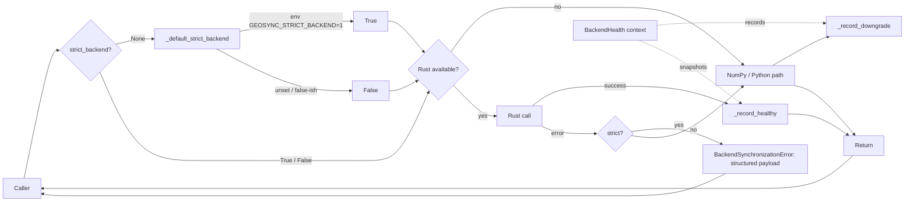

# Accelerator Observability

> *An exception is a question the system asks the operator.*
> *If the operator has to guess the answer, the exception is unfinished.*

This document is the architectural companion to [ADR-0018](adr/0018-accelerator-observability.md). It tells the story of how GeoSync's Rust-accelerated numeric helpers went from a silent fail-over with a bare exception to a first-class observability surface with four named primitives.

## The four primitives



### 1. `BackendSynchronizationError` — exception as audit event

Before: bare `RuntimeError` subclass, free-text message.

After:

```python
try:
    sliding_windows(data, window=32, step=8, strict_backend=True)
except BackendSynchronizationError as exc:
    audit_log.write(exc.to_dict())
    # {
    #   "message": "Rust sliding_windows backend failed with strict_backend=True",
    #   "backend": "rust",
    #   "reason": "runtime_error",
    #   "last_healthy_epoch_ns": 1745001234567890123,
    #   "downgrade_count": 42,
    # }
```

Operator reads the payload and knows exactly what, when, and how often.

### 2. Downgrade counter — silent degradation made visible

Before: `WARNING` log per fail-open downgrade. Under load, 10k/hr disappears into log noise.

After:

```python
from core.accelerators.numeric import downgrade_counts

snapshot = downgrade_counts()
# {("rust", "numpy", "runtime_error"): 10432,
#  ("rust", "numpy", "unavailable"): 0}
```

Thread-safe. Zero extra dependencies. Any Prometheus exporter or cron-scraper reads it in one line.

### 3. `GEOSYNC_STRICT_BACKEND` — one env, whole process

Before: every production call site had to pass `strict_backend=True` explicitly. Miss one and a silent downgrade slipped through.

After:

```bash
GEOSYNC_STRICT_BACKEND=1 python -m geosync.main
```

The env flip changes the process-wide default. Explicit `strict_backend=True` / `False` still wins over the env. Dev stays on fail-open; prod flips to fail-closed with one line.

### 4. `BackendHealth` — scoped span around a block

Before: to know how many downgrades a batch produced, you had to snapshot the counter yourself.

After:

```python
from core.accelerators.numeric import BackendHealth

with BackendHealth("ingest-batch-2026-04-19") as span:
    for frame in batch:
        sliding_windows(frame, window=32, step=8)
    convolve(signal, kernel, mode="same")

report = span.report()
audit_store.append(report.to_dict())
# {
#   "label": "ingest-batch-2026-04-19",
#   "wall_duration_s": 0.234,
#   "n_downgrades": 0,
#   "downgrades": {},
#   "last_healthy_epoch_ns": {"rust": 1745001234567890123},
# }
```

Nested spans do not contaminate each other — inner-span delta is computed from enter / exit snapshots of the counter, not from a shared mutable register.

## Before / after

| Operator question | Before | After |
|-------------------|--------|-------|
| *Which backend failed?* | Grep the message | `exc.backend` |
| *Why?* | Read the chained exception's repr | `exc.reason` |
| *Has this happened before?* | Grep logs for the hour | `exc.downgrade_count` |
| *When was the last healthy dispatch?* | Impossible to answer | `exc.last_healthy_epoch_ns` |
| *How many silent downgrades this shift?* | 0 — they were logged and lost | `downgrade_counts()` |
| *Can I flip production to fail-closed without touching code?* | No | `GEOSYNC_STRICT_BACKEND=1` |
| *How many downgrades did this batch produce?* | Count log lines | `span.report().n_downgrades` |

## Philosophy

The move from Sprint-1 to the master-class release is the move **from mechanism to contract**. A mechanism says "here is how the system fails closed". A contract says:

* what you will know when it fails,
* how you will know it without parsing free text,
* how you will see the trend, not only the spike,
* how you will flip the policy without a code change,
* how you will scope the observation to a meaningful block.

When every question an operator might reasonably ask has a typed answer, the system is not only fail-closed — it is **legible**. Legibility is the axis on which an exception graduates from a nuisance to an audit event.

## See also

* [ADR-0018](adr/0018-accelerator-observability.md) — the formal decision record.
* [`core/accelerators/numeric.py`](../core/accelerators/numeric.py) — source of truth.
* [`tests/unit/test_accelerator_telemetry.py`](../tests/unit/test_accelerator_telemetry.py) — Tier-1 invariants.
* [`tests/unit/test_accelerator_masterclass.py`](../tests/unit/test_accelerator_masterclass.py) — Tier-2/3 invariants.
