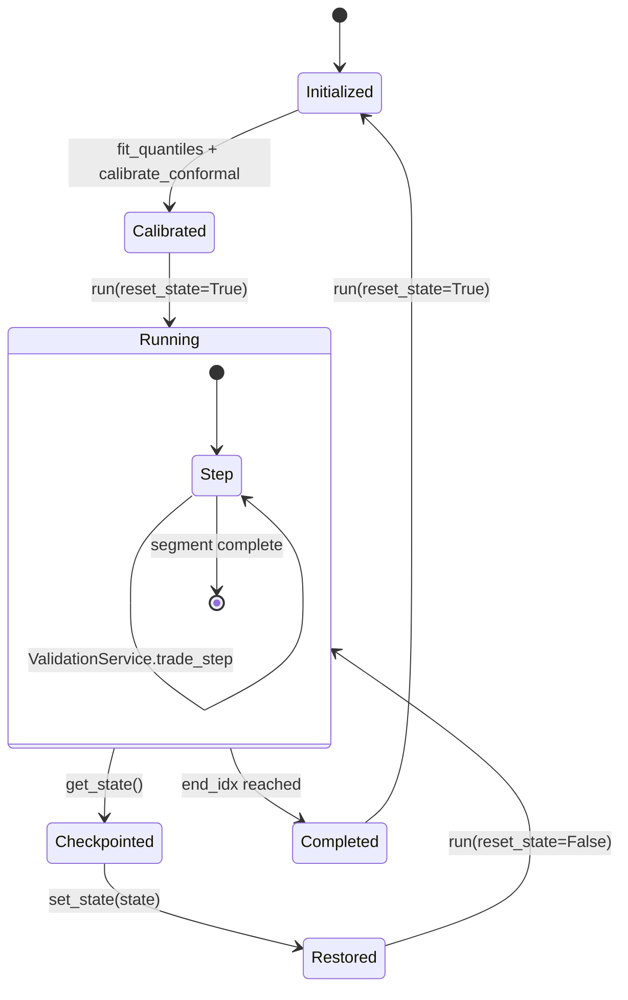

# BacktestSession State Diagram (One Page)

## Invariants
- No hidden mutable-state leakage between independent runs.
- Snapshot/restore preserves RNG, guardrails, conformal, feature, and regime states.
- Contract checks fail-fast on non-finite/non-physical runtime values.
