<!-- AUTO-GENERATED by tools.governance.render_lineage. DO NOT EDIT. -->
<!-- Re-run: `python -m tools.governance.render_lineage` -->

# D-002J / D-002K Verdict DAG — Lineage Map

Generator: `tools.governance.render_lineage`. 
Source: `artifacts/governance/verdicts/d002[jk]_p*_verdict_v1.json` 
(schema `D002J-VERDICT-CAPSULE-v1`).
Spans the connected D-002J / D-002K lineages: `D002K-P0`'s parent 
is `D002J-P7` — D-002K exists *because* D-002J-P7 terminally 
refused (no rescue).
Self-verdict node: `D002J-P2.5` (merge sha resolved at land time).

## §1 Lineage chain

```mermaid
graph LR
    D002J-P0[D002J-P0<br/>TERMINAL_PASS]
    D002J-P1[D002J-P1<br/>TERMINAL_PASS]
    D002J-P1A[D002J-P1A<br/>TERMINAL_REJECTED]
    D002J-P1B[D002J-P1B<br/>TERMINAL_PARTIAL]
    D002J-P2[D002J-P2<br/>TERMINAL_PASS]
    D002J-P3[D002J-P3<br/>TERMINAL_PASS]
    D002J-P4[D002J-P4<br/>TERMINAL_PASS]
    D002J-P5[D002J-P5<br/>TERMINAL_PASS]
    D002J-P6[D002J-P6<br/>TERMINAL_PASS]
    D002J-P7[D002J-P7<br/>TERMINAL_REFUSED]
    D002K-P0[D002K-P0<br/>TERMINAL_PASS]
    D002K-P1[D002K-P1<br/>TERMINAL_PASS]
    D002J-P0 --> D002J-P1
    D002J-P1 --> D002J-P1A
    D002J-P1A --> D002J-P1B
    D002J-P1B --> D002J-P2
    D002J-P2 --> D002J-P3
    D002J-P3 --> D002J-P4
    D002J-P4 --> D002J-P5
    D002J-P5 --> D002J-P6
    D002J-P6 --> D002J-P7
    D002J-P7 --> D002K-P0
    D002K-P0 --> D002K-P1
```



ASCII fallback:

```
D002J-P0 -> D002J-P1 -> D002J-P1A -> D002J-P1B -> D002J-P2 -> D002J-P3 -> D002J-P4 -> D002J-P5 -> D002J-P6 -> D002J-P7 -> D002K-P0 -> D002K-P1
```

## §2 Per-node table

| node_id | phase | PR | merge_sha (short) | decision | status | parent | allowed_next |
|---------|-------|----|-------------------|----------|--------|--------|--------------|
| `D002J-P0` | P0 | #694 | `22df530` | `D002J_PREREG_LOCKED` | `TERMINAL_PASS` | — | D002J-P1 |
| `D002J-P1` | P1 | #695 | `5b07ee3` | `DATA_REGISTRY_READY` | `TERMINAL_PASS` | D002J-P0 | D002J-P1A |
| `D002J-P1A` | P1A | #697 | `4b64faf` | `SOURCE_REGISTRY_REJECTED` | `TERMINAL_REJECTED` | D002J-P1 | D002J-P1B |
| `D002J-P1B` | P1B | #698 | `5102b00` | `SOURCE_REGISTRY_PARTIALLY_VERIFIED` | `TERMINAL_PARTIAL` | D002J-P1A | D002J-P2 |
| `D002J-P2` | P2 | #699 | `0557837` | `CRISIS_WINDOW_REGISTRY_READY` | `TERMINAL_PASS` | D002J-P1B | D002J-P2.5, D002J-P3 |
| `D002J-P3` | P3 | #701 | `0000000` | `INGESTION_MANIFEST_READY` | `TERMINAL_PASS` | D002J-P2 | D002J-P4 |
| `D002J-P4` | P4 | #702 | `0000000` | `POSITIVE_CONTROLS_READY` | `TERMINAL_PASS` | D002J-P3 | D002J-P5 |
| `D002J-P5` | P5 | #703 | `0000000` | `SUBSTRATE_CANDIDATES_READY` | `TERMINAL_PASS` | D002J-P4 | D002J-P6 |
| `D002J-P6` | P6 | #0 | `0000000` | `NULL_HIERARCHY_READY` | `TERMINAL_PASS` | D002J-P5 | D002J-P7 |
| `D002J-P7` | P7 | #0 | `0000000` | `POWER_GATE_REFUSED_UNDERPOWERED` | `TERMINAL_REFUSED` | D002J-P6 | — |
| `D002K-P0` | P0 | #0 | `0000000` | `D002K_PREREG_LOCKED` | `TERMINAL_PASS` | D002J-P7 | D002K-P1 |
| `D002K-P1` | P1 | #0 | `0000000` | `D002K_SOURCE_OBSERVABLE_CONTRACT_READY` | `TERMINAL_PASS` | D002K-P0 | D002K-P2 |

## §3 Retained rejected nodes

These nodes shipped a TERMINAL_REJECTED or TERMINAL_REFUSED verdict and are retained verbatim as truthful negative artifacts. Subsequent phases repair the underlying defect without rewriting history.

### `D002J-P1A` — `SOURCE_REGISTRY_REJECTED`

- PR #697 at `4b64faf67f4c1bec48a66d20eeddbdf6931e762d`
- Repaired by: `D002J-P1B`
- Failure retention:

  > information_constraint mechanism family had only 1 verified_or_partial source (ALFRED, audit_status PARTIAL); 5 broken provenance URLs (ECB_CBD sdw.ecb DNS NXDOMAIN; ICAP_MOVE methodology PDF 404; BIS_QR_NETWORK 404; FED_TIMELINE financial-crisis-timeline 404; BOE_LDI_REVIEW FSR 2022 + working paper 404). Retained verbatim in docs/research/D002J_SOURCE_DOWNGRADE_LOG.md (P1A section preserved through P1B append).

### `D002J-P7` — `POWER_GATE_REFUSED_UNDERPOWERED`

- PR #0 at `0000000000000000000000000000000000000000`
- Repaired by: `D002K-P0`
- Failure retention:

  > REFUSED on axis 'effect_too_small'. With the explicit Bonferroni denominator of 102 canonical cells (alpha=4.90e-4) and the honest P4-sourced effect-size priors (Cohen's d in {0.30, 0.40, 0.50}), n_min in {150, 235, 417} per cell -- every one above the most-generous runtime-affordable feasible cap of 100 seeds (set just above the D-002I median anchor n_min~=93 and 5x the D-002H budget of 20). Runtime is NOT the binding constraint (measured per-sim ~4e-5 s; projected local sweep < 0.1 h): the binding constraint is purely that the realistic per-cell substrate-vs-null separation, sourced honestly from the P4 ground-truth magnitudes, is too small to reach power>=0.8 at the Bonferroni-corrected alpha within a feasible per-cell seed budget. This is the SAME failure mode D-002I diagnosed for D-002H (sub-threshold signal + insufficient grid power). The full per-cell power table, the explicit Bonferroni derivation, the measured runtime probe and the false-negative-risk quantification are retained in artifacts/d002j/power/power_report_v1.json as a truthful negative artifact. Forward motion is NOT P8: it requires a fresh D-002K pre-registration designed against the effect-too-small axis (e.g. a higher-SNR observable, a window-conditioned statistic, or a substantively re-derived effect-size prior with new ground truth -- NOT a relaxed alpha or an inflated prior).

## §4 Next legal nodes from main HEAD

- `D002K-P2`

## §5 Forbidden claims aggregate

Every node in the DAG carries a `claim_boundary`. The union of forbidden
claims is enforced fail-closed across the entire D-002J lineage. No PR
may state, imply, or rely on any of the following:

- GeoSync predicts systemic crises
- GeoSync is bank-level validated
- D-002J rescues D-002H
- cross-asset coherence proves interbank contagion
- positive controls prove real-world performance
- source registry proves data quality
- crisis windows prove predictive power

## §6 Locked governance SHAs (byte-exact)

These six anchors are protected by acceptor `forbidden_paths` and by
the byte-exact sha256 set in `tools.governance.verdict_dag.LOCKED_GOVERNANCE_SHAS`.

| path | sha256 |
|------|--------|
| `docs/governance/D002C_CLAIM_LEDGER.yaml` | `eb0b7151d76e5409e6dc9bb4a023551de5e0704673d5ac9f726319ef84a32387` |
| `docs/governance/D002G_ACCEPTANCE_RULES.md` | `875b1e3eb031b8e5333dc8b455454f0a30419ead1ebe787aa01d5882e7d6ad31` |
| `docs/governance/D002G_PREREGISTRATION.yaml` | `1ab91f09370e4705a8b0849467bc1f56df2e58d58d5623d3b6d905cbd110bb04` |
| `docs/governance/D002H_PREREGISTRATION.yaml` | `44b18b5a40ce9d188a9c3bd49339621f81a65a15f97a683247902450dd54acec` |
| `docs/governance/D002I_PREREGISTRATION.yaml` | `b646989c032dc0e29f9b791e0b68209ff22b40f4757737712badc8656cf2db5f` |
| `docs/governance/D002J_PREREGISTRATION.yaml` | `f3dc65b7e64b96eafe6f23ca8bdd0e05dc9bf95b12c2658b227bd0340f7975a0` |

